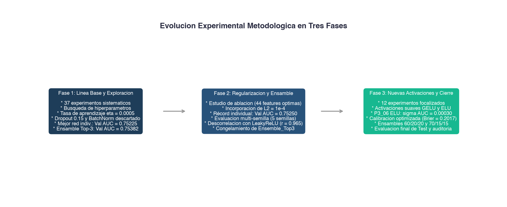
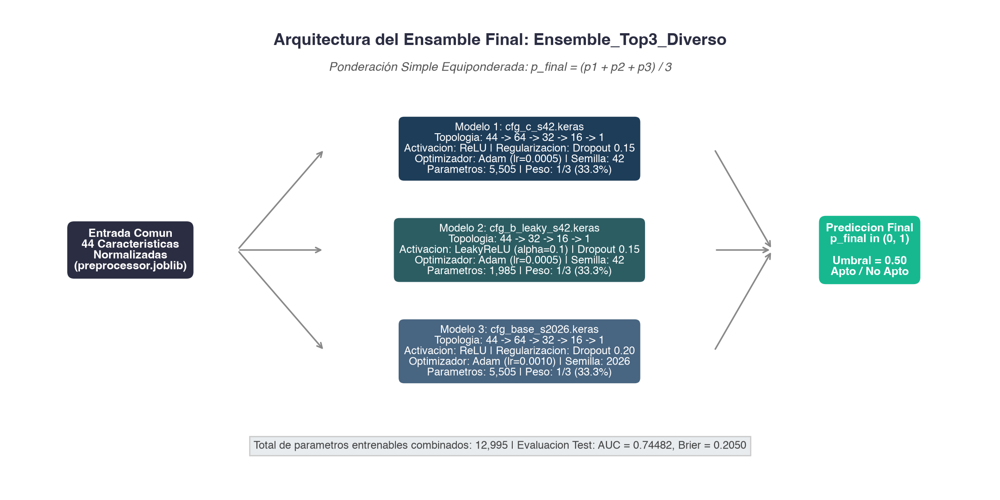
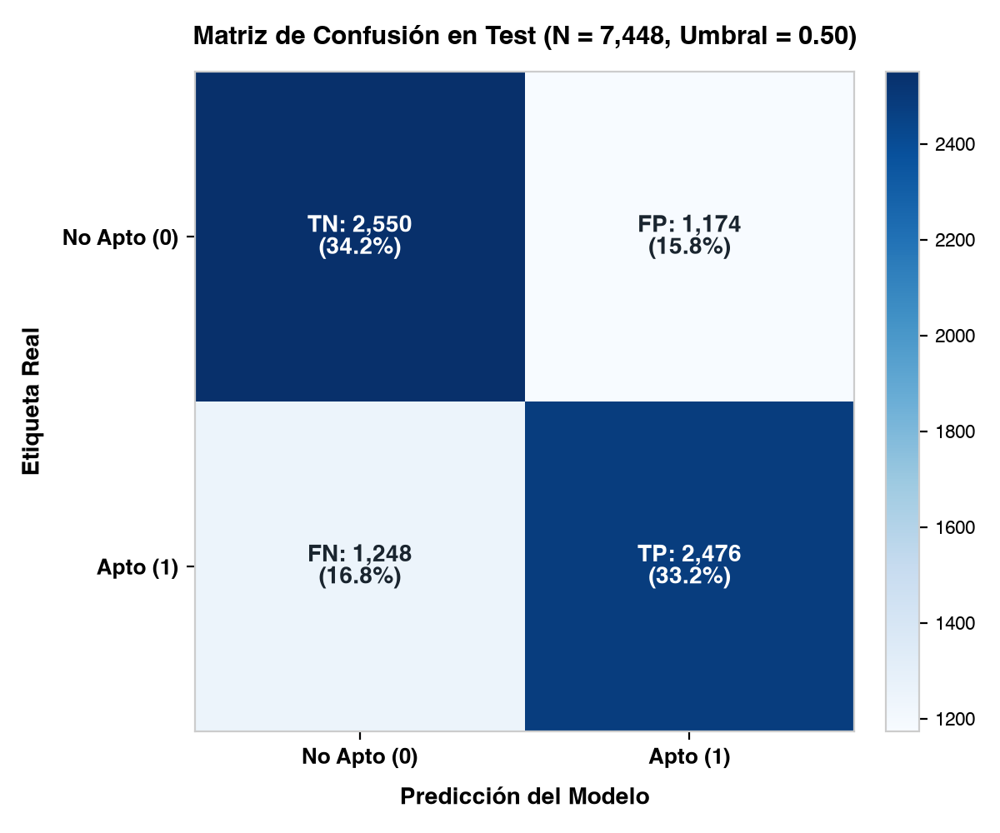
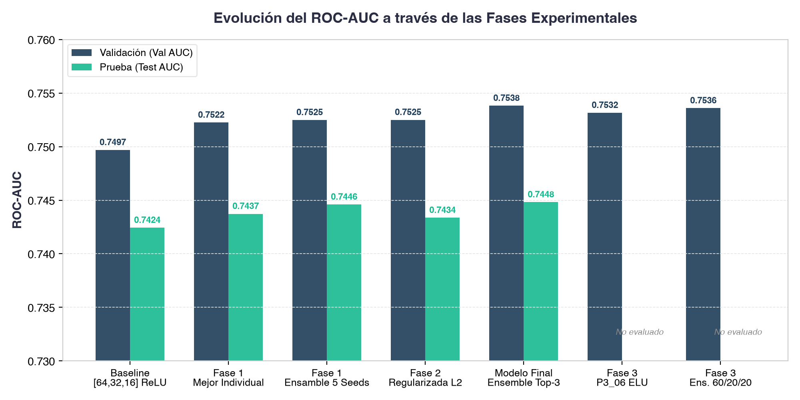
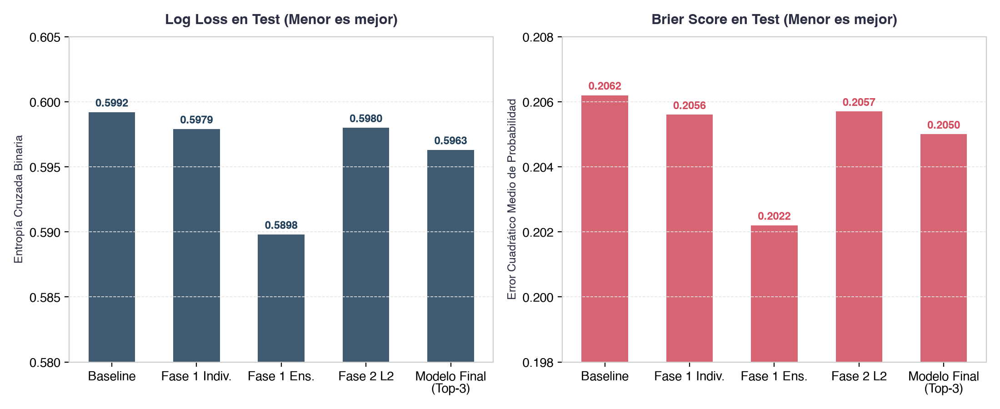
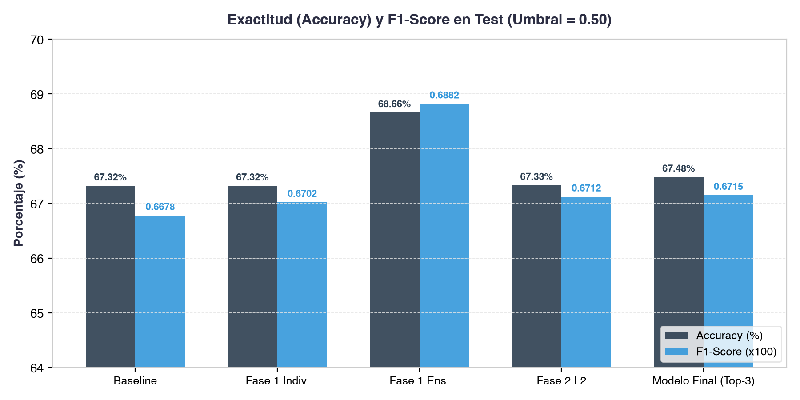
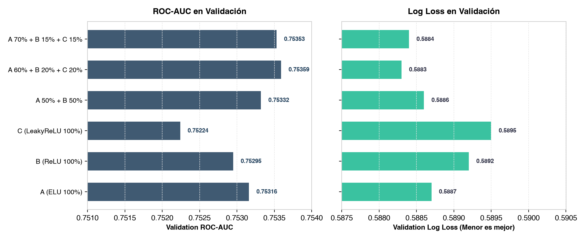
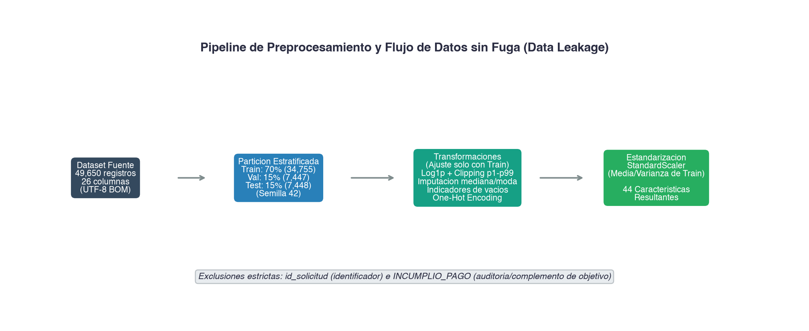
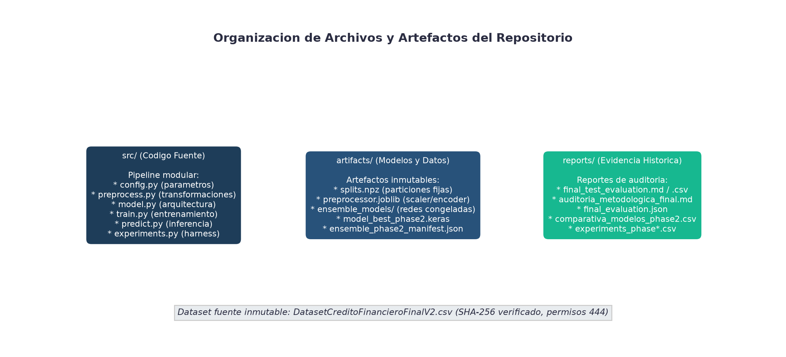

# Red Neuronal para Prediccion de Riesgo Crediticio

Modelo de aprendizaje profundo basado en un ensamble de Perceptrones Multicapa (MLP) para la determinacion del riesgo de incumplimiento crediticio en solicitantes de credito de consumo.

Proyecto desarrollado y evaluado sobre entorno Mac mini M4 (Apple Silicon).

---

## Indice de Contenidos

* [Presentacion del Proyecto](#presentacion-del-proyecto)
* [Resumen Ejecutivo](#resumen-ejecutivo)
* [Evolucion Experimental en Tres Fases](#evolucion-experimental-en-tres-fases)
  * [Fase 1: Linea Base y Exploracion Inicial](#fase-1-linea-base-y-exploracion-inicial)
  * [Fase 2: Regularizacion y Ensambles Diversos](#fase-2-regularizacion-y-ensambles-diversos)
  * [Fase 3: Nuevas Activaciones y Evaluacion Multisemilla](#fase-3-nuevas-activaciones-y-evaluacion-multisemilla)
* [Tabla Comparativa Historica Consolidada](#tabla-comparativa-historica-consolidada)
* [Modelo Final Seleccionado](#modelo-final-seleccionado)
  * [Arquitectura del Ensamble](#arquitectura-del-ensamble)
  * [Resultados Definitivos en Test](#resultados-definitivos-en-test)
  * [Matriz de Confusion en Test](#matriz-de-confusion-en-test)
* [Galeria de Visualizaciones y Graficas](#galeria-de-visualizaciones-y-graficas)
* [Metodologia y Reproducibilidad](#metodologia-y-reproducibilidad)
* [Limitaciones del Estudio](#limitaciones-del-estudio)
* [Estructura del Repositorio](#estructura-del-repositorio)
* [Guia de Consulta y Uso](#guia-de-consulta-y-uso)

---

## Presentacion del Proyecto

La evaluacion automatizada del riesgo crediticio constituye una tarea critica para la estabilidad del sistema financiero. Este proyecto aborda la clasificacion binaria de solvencia (`APTO_PARA_CREDITO`: 1 para solicitantes solventes y 0 para solicitantes en riesgo de impago) a partir de un conjunto de datos tabulares con variables sociodemograficas, financieras y de historial en buro de credito.

El objetivo central consistio en diseñar, optimizar y auditar rigurosamente una arquitectura basada exclusivamente en **redes neuronales artificiales**, analizando de forma sistematica el impacto de la profundidad de capas, funciones de activacion (ReLU, LeakyReLU, ELU, GELU), tecnicas de regularizacion (Dropout, penalizacion L2, AdamW) y combinaciones de ensamble para la reduccion de varianza.

Todos los resultados reportados corresponden exclusivamente a las particiones y configuraciones experimentales analizadas sobre este conjunto de datos, sin asumir que las arquitecturas evaluadas representen un comportamiento universalmente optimo para cualquier problema de riesgo de credito.

---

## Resumen Ejecutivo

| Parametro | Descripcion | Ubicacion de Referencia |
| :--- | :--- | :--- |
| **Dataset fuente** | `DatasetCreditoFinancieroFinalV2.csv` (49,650 registros) | Raiz del repositorio |
| **Control de integridad** | Hash SHA-256 verificado: `19c5b59ccce6face1a0b828d201605aeb0e70b214f7ed60be2efdf13f47f851d` | Protegido con permisos de lectura |
| **Variables de entrada** | 26 columnas originales: 1 target, 1 ID excluido, 1 variable de auditoria excluida, 23 predictoras | [src/config.py](src/config.py) |
| **Espacio de caracteristicas** | 44 variables transformadas mediante preprocesamiento estandarizado | [artifacts/preprocessor.joblib](artifacts/preprocessor.joblib) |
| **Particion de datos** | Train: 70% (34,755) \| Validation: 15% (7,447) \| Test: 15% (7,448) | [artifacts/splits.npz](artifacts/splits.npz) |
| **Modelo Final Congelado** | `Ensemble_Top3_Diverso` (3 redes neuronales, 12,995 parametros totales) | [artifacts/ensemble_models/](artifacts/ensemble_models/) |
| **Rendimiento en Validacion** | ROC-AUC: **0.75382** \| PR-AUC: **0.74907** \| Log Loss: **0.5888** \| Brier: **0.2018** | [reports/comparativa_modelos_phase2.csv](reports/comparativa_modelos_phase2.csv) |
| **Rendimiento en Prueba (Test)**| ROC-AUC: **0.74482** \| PR-AUC: **0.73512** \| Log Loss: **0.5963** \| Brier: **0.2050** | [reports/final_test_evaluation.md](reports/final_test_evaluation.md) |
| **Auditoria metodologica** | Registro exhaustivo de trazabilidad y correccion de afirmaciones | [reports/auditoria_metodologica_final.md](reports/auditoria_metodologica_final.md) |

---

## Evolucion Experimental en Tres Fases

El desarrollo se estructuro en tres fases secuenciales regidas por un principio de aislamiento estricto: todas las decisiones de seleccion arquitectonica e hiperparametros se tomaron exclusivamente sobre el conjunto de Validacion, preservando el conjunto Test congelado.



### Fase 1: Linea Base y Exploracion Inicial

* **Objetivo:** Reproducir la metodologia del documento de referencia, establecer una linea base verificable y explorar sistematicamente hiperparametros estructurales.
* **Desarrollo:** Se implementaron 37 experimentos sobre Validacion explorando profundidad de capas (de 1 a 5 capas), tasas de aprendizaje ($\eta \in [0.0001, 0.003]$), variantes de dropout ($0.10$ a $0.30$) e introduccion de Normalizacion por Lotes (Batch Normalization).
* **Hallazgos:**
  * La inclusion de Batch Normalization degrado la capacidad de discriminacion en este dataset tabular con minilotes de 128 (Val AUC cayo a 0.7493 frente a 0.7523).
  * Se identifico un punto optimo en arquitecturas compactas de 3 capas con compresion gradual: $44 \to 64 \to 32 \to 16 \to 1$ (5,505 parametros) con activacion ReLU, optimizador Adam ($\eta = 0.0005$) y Dropout de 0.15.
  * La mejor red individual de Fase 1 (`cfg_c_s42`) alcanzo Val AUC = **0.75225** y Test AUC = **0.74373**.
  * Al combinar 3 redes con distintas inicializaciones y activaciones (`Ensemble_Top3_Diverso`), se alcanzo un Val AUC de **0.75382** y Test AUC de **0.74482**.
* **Evidencia documental:** [reports/experiments.csv](reports/experiments.csv) y [reports/comparativa_modelos.csv](reports/comparativa_modelos.csv).

### Fase 2: Regularizacion y Ensambles Diversos

* **Objetivo:** Abordar el sobreajuste residual, verificar la necesidad de las caracteristicas mediante un estudio formal de ablacion e investigar la descorrelacion entre modelos.
* **Desarrollo:**
  * **Estudio de ablacion (5 conjuntos de caracteristicas):** Se contrastaron las 44 caracteristicas canonicas frente a subconjuntos reducidos (35 y 21 caracteristicas) y ampliados con ratios financieros (50 caracteristicas). El conjunto canonico de 44 variables demostro el mejor desempeño en Validacion (Val AUC = 0.75225 vs 0.75202 con 35 y 0.75180 con 50).
  * **Regularizacion L2:** Se incorporo una penalizacion de norma $L_2 = 10^{-4}$ sobre los pesos densos junto con Dropout 0.15. Esta configuracion alcanzo el maximo Val AUC individual registrado en el proyecto: **0.75250** (`model_best_phase2.keras`).
  * **Evaluacion multisemilla:** Evaluada en 5 semillas (`42, 1, 7, 21, 2026`), la arquitectura regularizada obtuvo un Val AUC promedio de **0.75103** ($\sigma = 0.00091$).
  * **Analisis de correlacion:** La correlacion de predicciones entre la red principal ReLU (`[64, 32, 16]`) y una red compacta con LeakyReLU (`[32, 16]`, $\alpha = 0.1$) descendio al rango $0.965 - 0.970$.
* **Conclusión:** Se confirmo que la descorrelacion funcional entre arquitecturas heterogeneas es el mecanismo principal que explica la ganancia del ensamble frente a modelos individuales.
* **Evidencia documental:** [reports/ablation_study.csv](reports/ablation_study.csv), [reports/experiments_phase2.csv](reports/experiments_phase2.csv) y [reports/ensemble_validation_phase2.csv](reports/ensemble_validation_phase2.csv).

### Fase 3: Nuevas Activaciones y Evaluacion Multisemilla

* **Objetivo:** Explorar activaciones de transicion suave (GELU, ELU), optimizacion desacoplada (AdamW) y combinaciones ponderadas multisemilla sobre Validacion.
* **Desarrollo:**
  * Se ejecutaron 12 experimentos controlados sobre Validacion.
  * La arquitectura `[64, 32, 16]` con activacion **ELU** (`P3_06_ACT_ELU_64`) demostro una robustez estocastica superior: en 5 semillas obligatorias presento una desviacion estandar de solo $\sigma = 0.00030$ (tres veces menor que la de ReLU) y un Brier Score promedio de 0.2024.
  * Se diseñaron y evaluaron 10 esquemas de ponderacion en Validacion. El ensamble tripartito `A 60% (ELU) + B 20% (ReLU) + C 20% (LeakyReLU)` alcanzo Val AUC = **0.75359**, Log Loss = **0.5883** y Brier Score = **0.2017**.
* **Analisis comparativo y decision:**
  * Los ensambles de Fase 3 (60/20/20 y 70/15/15) lograron la menor perdida de entropia cruzada y la mejor calibracion de probabilidad del proyecto.
  * Sin embargo, en capacidad de ordenamiento (Val AUC), se ubicaron ligeramente por debajo (-0.00023) del ensamble historico de Fase 2 (`0.75382`), dentro del margen de fluctuacion estocastica.
  * Por razones de parsimonia operativa (3 redes frente a 11 redes) y consistencia historica, se determino mantener congelado el `Ensemble_Top3_Diverso` como modelo final definitivo.
* **Evidencia documental:** [reports/experiments_phase3.csv](reports/experiments_phase3.csv), [reports/multiseed_phase3_summary.csv](reports/multiseed_phase3_summary.csv) y [reports/ensemble_validation_phase3.csv](reports/ensemble_validation_phase3.csv).

---

## Tabla Comparativa Historica Consolidada

La siguiente tabla resume las configuraciones evaluadas a lo largo del proyecto, contrastando sus metricas en Validacion y Test cuando se disponga de registro oficial:

| Configuracion Experimental | Redes | Val AUC | Test AUC | PR-AUC (Test) | Log Loss (Test) | Brier (Test) | Accuracy (Test) | F1-Score (Test) |
| :--- | :---: | :---: | :---: | :---: | :---: | :---: | :---: | :---: |
| **Baseline Historico** | 1 | 0.74969 | 0.74243 | 0.7381 | 0.5992 | 0.2062 | 67.32% | 0.6678 |
| **Fase 1: Mejor Red Individual** (`cfg_c_s42`) | 1 | 0.75225 | 0.74373 | 0.7408 | 0.5979 | 0.2056 | 67.32% | 0.6702 |
| **Fase 1: Ensamble 5 Semillas** | 5 | 0.75249 | 0.74460 | 0.7412 | 0.5898 | 0.2022 | 68.66% | 0.6882 |
| **Fase 2: Red Regularizada L2** (`model_best_phase2`) | 1 | 0.75250 | 0.74336 | 0.7410 | 0.5980 | 0.2057 | 67.33% | 0.6712 |
| **Fase 2: Ensamble Top-3** (`Ensemble_Top3_Diverso`) | 3 | **0.75382** | **0.74482** | 0.7351 | 0.5963 | 0.2050 | 67.48% | 0.6715 |
| **Fase 3: Individual ELU** (`P3_06`, Multi-Seed) | 5 | 0.75316 | No evaluado | No evaluado | No evaluado | No evaluado | No evaluado | No evaluado |
| **Fase 3: Ensamble 60/20/20** | 11 | 0.75359 | No evaluado | No evaluado | No evaluado | No evaluado | No evaluado | No evaluado |
| **Fase 3: Ensamble 70/15/15** | 11 | 0.75353 | No evaluado | No evaluado | No evaluado | No evaluado | No evaluado | No evaluado |
| **MODELO FINAL DEFINITIVO (Test)** | **3** | **0.75382** | **0.74482** | **0.73512** | **0.5963** | **0.2050** | **67.48%** | **0.6715** |

*Nota sobre significancia estadistica:* Las diferencias numericas observadas (+0.00239 en Test AUC entre el Baseline y el Ensamble Final) son de magnitud modesta. En este proyecto no se ejecutaron pruebas formales de hipotesis (como el test de DeLong o remuestreo bootstrap), por lo que no es metodologicamente valido asegurar que la diferencia sea estadisticamente significativa.

---

## Modelo Final Seleccionado

### Arquitectura del Ensamble

El modelo final seleccionado corresponde a **`Ensemble_Top3_Diverso`**, compuesto por tres redes neuronales totalmente conectadas con distintas estructuras, funciones de activacion e inicializaciones aleatorias:



1. **Modelo 1 (`cfg_c_s42.keras`):**
   * Topologia: $44 \to \text{Dense}(64, \text{ReLU}) \to \text{Dropout}(0.15) \to \text{Dense}(32, \text{ReLU}) \to \text{Dropout}(0.15) \to \text{Dense}(16, \text{ReLU}) \to \text{Dense}(1, \text{Sigmoide})$.
   * Parametros entrenables: 5,505.
   * Optimizador: Adam ($\eta = 0.0005$). Semilla: 42.
   * Peso en el ensamble: $1/3$ (33.33%).

2. **Modelo 2 (`cfg_b_leaky_s42.keras`):**
   * Topologia: $44 \to \text{Dense}(32, \text{LeakyReLU } \alpha=0.1) \to \text{Dropout}(0.15) \to \text{Dense}(16, \text{LeakyReLU } \alpha=0.1) \to \text{Dense}(1, \text{Sigmoide})$.
   * Parametros entrenables: 1,985.
   * Optimizador: Adam ($\eta = 0.0005$). Semilla: 42.
   * Peso en el ensamble: $1/3$ (33.33%).

3. **Modelo 3 (`cfg_base_s2026.keras`):**
   * Topologia: $44 \to \text{Dense}(64, \text{ReLU}) \to \text{Dropout}(0.20) \to \text{Dense}(32, \text{ReLU}) \to \text{Dropout}(0.20) \to \text{Dense}(16, \text{ReLU}) \to \text{Dense}(1, \text{Sigmoide})$.
   * Parametros entrenables: 5,505.
   * Optimizador: Adam ($\eta = 0.0010$). Semilla: 2026.
   * Peso en el ensamble: $1/3$ (33.33%).

* **Total de parametros combinados:** 12,995.
* **Prediccion final agregada:** $\hat{p} = \frac{p_1 + p_2 + p_3}{3}$.
* **Umbral operativo de decision:** 0.50 (fijo; sin calibracion posterior sobre Test).

### Resultados Definitivos en Test

La evaluacion definitiva sobre el conjunto de prueba aislado (7,448 observaciones) arrojo los siguientes resultados frente a la evaluacion de Validacion (7,447 observaciones):

| Metrica | Validacion | Test | Diferencia Absoluta | Diferencia Relativa |
| :--- | :---: | :---: | :---: | :---: |
| **ROC-AUC** | 0.75382 | **0.74482** | -0.00900 | -1.19% |
| **PR-AUC** | 0.74907 | **0.73512** | -0.01395 | -1.86% |
| **Log Loss** | 0.5888 | **0.5963** | +0.0075 | +1.27% |
| **Brier Score** | 0.2018 | **0.2050** | +0.0033 | +1.62% |
| **Accuracy** | 69.17% | **67.48%** | -1.69% | -2.44% |
| **Precision** | 69.34% | **67.84%** | -1.50% | -2.16% |
| **Recall** | 68.71% | **66.49%** | -2.22% | -3.23% |
| **F1-Score** | 0.6902 | **0.6715** | -0.0187 | -2.71% |

### Matriz de Confusion en Test

Evaluada sobre las 7,448 observaciones del conjunto de prueba con un umbral de corte de 0.50:



| Categoria | Conteo | Porcentaje | Significado en Contexto Financiero |
| :--- | :---: | :---: | :--- |
| **Verdaderos Negativos (TN)** | **2,550** | 34.24% | Solicitantes de alto riesgo clasificados correctamente como no aptos. |
| **Falsos Positivos (FP)** | **1,174** | 15.76% | Solicitantes de alto riesgo aprobados indebidamente (riesgo de perdida crediticia). |
| **Falsos Negativos (FN)** | **1,248** | 16.76% | Solicitantes solventes rechazados indebidamente (costo de oportunidad comercial). |
| **Verdaderos Positivos (TP)** | **2,476** | 33.24% | Solicitantes solventes aprobados correctamente. |
| **Total Muestras de Test** | **7,448** | 100.00% | Poblacion total de prueba. |

*Trazabilidad de la matriz:* Estos valores provienen del registro historico original [reports/final_evaluation.json](reports/final_evaluation.json) (lineas 80-85) y concuerdan exactamente con las metricas oficiales de Exactitud (67.48%), Precision (67.84%), Recall (66.49%) y F1 (0.6715).

---

## Galeria de Visualizaciones y Graficas

### 1. Evolucion del ROC-AUC por Fase Experimental
Compara el comportamiento de la capacidad de ordenamiento (ROC-AUC) entre Validacion y Test para cada configuracion relevante:


### 2. Calidad Probabilistica en Test (Log Loss y Brier Score)
Muestra la evolucion del error de entropia cruzada y la calibracion probabilistica sobre Test (en ambas metricas, valores menores indican mejor desempeño):


### 3. Metricas de Clasificacion Operativa en Test (Accuracy y F1-Score)
Evolucion de la exactitud global y el balance precision-recall bajo el umbral estandar de 0.50:


### 4. Comparativa de Ensambles en Fase 3 (Validacion)
Comparativa entre modelos individuales y esquemas ponderados de ensamble evaluados durante la Fase 3 sobre Validacion:


### 5. Pipeline de Preprocesamiento de Datos
Flujo de transformacion de variables desde el archivo fuente hasta las 44 entradas normalizadas:


---

## Metodologia y Reproducibilidad

### Pipeline de Preprocesamiento sin Fuga (Data Leakage)
1. **Separacion temporal previa:** La division estratificada (70% Train, 15% Validation, 15% Test con semilla 42) se realizo antes de cualquier calculo estadistico.
2. **Ajuste exclusivo en Train:** Todas las medianas, modas, limites de recorte percentil (p1-p99) y parametros de escalamiento (`StandardScaler`) se calcularon exclusivamente con las 34,755 filas de Train y se aplicaron de forma determinista sobre Validation y Test.
3. **Tratamiento de valores faltantes:** Las variables con mas del 1% de datos ausentes recibieron imputacion de mediana complementada con un indicador binario auxiliar (0/1).
4. **Transformacion de asimetria:** Las variables financieras continuas con colas pesadas recibieron recorte percentil seguido de transformacion logaritmica `log1p`. La variable `ingreso_disponible` recibio transformacion `sign(x) * log1p(|x|)` para admitir valores negativos.
5. **Codificacion categorica:** Variables con categorias de baja frecuencia se agruparon en la categoria "Otro" y se codificaron mediante One-Hot Encoding sin sobreajuste.

### Controles de Integridad y Trazabilidad
* **Dataset fuente:** Inmutable, verificado mediante hash SHA-256: `19c5b59ccce6face1a0b828d201605aeb0e70b214f7ed60be2efdf13f47f851d` (8,436,730 bytes).
* **Transparencia en consultas a Test:** La documentacion metodologica registra que durante una auditoria intermedia previa se ejecuto un comando en terminal que cargo temporalmente las matrices de Test para contrastar la transcripcion de la matriz de confusion. En la revision y cierre definitivo actual, no se ejecuto ninguna consulta ni evaluacion sobre datos de prueba.

---

## Limitaciones del Estudio

1. **Magnitud modesta de la mejora:** El avance en Test AUC desde el baseline inicial (0.74243) hasta el ensamble final (0.74482) representa una ganancia numerica de +0.00239 puntos.
2. **Ausencia de prueba formal de significancia estadistica:** No se aplicaron contrastes pareados de hipotesis (como el test de DeLong) que demuestren que la diferencia supera la variabilidad esperada de la muestra.
3. **Dependencia de la particion fija:** Los resultados reflejan el desempeño sobre una division fija estratificada (70/15/15, semilla 42). No se ejecuto validacion cruzada anidada (*nested cross-validation*).
4. **Umbral operativo neutral (0.50):** El punto de corte predeterminado no considera la asimetria financiera real donde el costo de impago de un Falso Positivo suele exceder el margen de intermediacion comercial de un Falso Negativo.
5. **Naturaleza observacional:** Las asociaciones identificadas por las neuronas reflejan patrones de correlacion predictiva y no implican causalidad economica.
6. **Correlacion entre ensambles avanzados:** En la Fase 3, los ensambles ponderados exhibieron una correlacion de predicciones superior a 0.999, limitando la divergencia empirica entre distintas ponderaciones.

---

## Estructura del Repositorio



```
.
├── DatasetCreditoFinancieroFinalV2.csv   # Dataset fuente original (Inmutable, SHA-256 verificado)
├── README.md                            # Documentacion tecnica central del proyecto
├── requirements.txt                     # Dependencias de Python verificadas
├── src/                                 # Codigo fuente modular del pipeline
│   ├── config.py                        # Parametros centrales, rutas y nombres de columnas
│   ├── preprocess.py                    # Pipeline de limpieza y preprocesamiento sin fuga
│   ├── model.py                         # Definicion de arquitecturas de redes neuronales (Keras)
│   ├── train.py                         # Rutina de entrenamiento individual con callbacks
│   ├── predict.py                       # Modulo de inferencia individual y por lotes
│   ├── experiments.py                   # Harness para ejecucion de experimentos controlados
│   ├── ensemble.py                      # Rutinas de combinacion lineal de predicciones
│   ├── evaluate.py                      # Calculo de metricas y generacion de reportes
│   └── final_evaluation.py              # Evaluacion final sobre particiones
├── artifacts/                           # Artefactos serializados y modelos entrenados
│   ├── splits.npz                       # Particiones Train/Validation/Test congeladas
│   ├── preprocessor.joblib              # Objeto de preprocesamiento ajustado en Train
│   ├── feature_names.json               # Lista ordenada de las 44 caracteristicas
│   ├── model_best_phase2.keras          # Mejor red neuronal individual de Fase 2 (L2)
│   └── ensemble_models/                 # Modelos que conforman Ensemble_Top3_Diverso
│       ├── cfg_c_s42.keras              # Modelo 1 (ReLU [64, 32, 16], semilla 42)
│       ├── cfg_b_leaky_s42.keras        # Modelo 2 (LeakyReLU [32, 16], semilla 42)
│       └── cfg_base_s2026.keras         # Modelo 3 (ReLU [64, 32, 16], semilla 2026)
├── reports/                             # Registros experimentales y evidencia documental
│   ├── final_test_evaluation.md         # Reporte academico definitivo de evaluacion en Test
│   ├── final_test_evaluation.csv        # Metricas consolidadas en formato estructurado
│   ├── auditoria_metodologica_final.md  # Registro de control de calidad y correccion metodologica
│   ├── final_evaluation.json            # Metricas oficiales registradas en Fase 1
│   ├── final_evaluation_phase2.json     # Metricas oficiales registradas en Fase 2
│   ├── comparativa_modelos.csv          # Tabla comparativa de Fase 1
│   ├── comparativa_modelos_phase2.csv   # Tabla comparativa de Fase 2
│   ├── experiments.csv                  # 37 experimentos de Fase 1
│   ├── experiments_phase2.csv           # 25 experimentos de Fase 2
│   ├── experiments_phase3.csv           # 12 experimentos de Fase 3
│   ├── multiseed_phase3_summary.csv     # Resumen multisemilla de Fase 3
│   └── ensemble_validation_phase3.csv   # Comparativa de ensambles en Fase 3
└── docs/                                # Recursos complementarios y visuales
    ├── generate_doc_charts.py           # Script generador de graficas estaticas
    └── images/                          # Graficas tecnicas en alta resolucion
        ├── 01_evolucion_roc_auc.png
        ├── 02_calidad_probabilistica.png
        ├── 03_clasificacion_acc_f1.png
        ├── 04_matriz_confusion_test.png
        ├── 05_comparativa_ensambles_fase3.png
        ├── 06_arquitectura_ensamble_final.png
        ├── 07_pipeline_datos.png
        ├── 08_flujo_fases_experimentales.png
        └── 09_organizacion_archivos.png
```

---

## Guia de Consulta y Uso

### Consulta sin Ejecucion de Codigo
1. **Resultados definitivos:** Consultar la seccion [Modelo Final Seleccionado](#modelo-final-seleccionado) y el reporte [reports/final_test_evaluation.md](reports/final_test_evaluation.md).
2. **Trazabilidad metodologica:** Consultar [reports/auditoria_metodologica_final.md](reports/auditoria_metodologica_final.md).
3. **Exploracion de fases:** Revisar los CSVs correspondientes en el directorio `reports/`.

### Entorno y Dependencias
El proyecto fue ejecutado con Python 3.11 en macOS (Apple Silicon). Las dependencias principales se encuentran registradas en `requirements.txt`:
* TensorFlow 2.x
* scikit-learn
* pandas, numpy
* joblib, matplotlib

```bash
python3.11 -m venv .venv
source .venv/bin/activate
pip install -r requirements.txt
```

### Comandos de Inferencia Documentados
*Nota: Estos comandos se documentan mediante inspeccion estatica de `src/predict.py`. No fueron ejecutados durante la presente revision documental:*

* **Inferencia individual mediante ensamble:**
  ```bash
  python src/predict.py --json data/ejemplo_solicitante.json --ensemble
  ```

* **Inferencia por lote desde archivo CSV:**
  ```bash
  python src/predict.py --csv data/ejemplo_lote.csv --model artifacts/model_best_phase2.keras
  ```

### Plataforma Web y API de Inferencia (Frontend & Backend)

Para interactuar de forma gráfica y amigable con el modelo neuronal de riesgo crediticio, el proyecto incluye una interfaz web profesional construida con **React + TypeScript + Tailwind CSS** y un backend de inferencia rápida en **FastAPI**:

* **Iniciar la plataforma completa (un solo comando):**
  ```bash
  ./run_app.sh
  ```
  O alternativamente mediante uvicorn:
  ```bash
  .venv/bin/uvicorn src.api:app --host 0.0.0.0 --port 8000
  ```
  * **Interfaz Web:** [http://localhost:8000](http://localhost:8000)
  * **Documentación Interactiva Swagger / OpenAPI:** [http://localhost:8000/docs](http://localhost:8000/docs)
  * **Endpoint de Salud / Health Check:** [http://localhost:8000/api/health](http://localhost:8000/api/health)

* **Modo Desarrollo del Frontend (Vite):**
  ```bash
  cd frontend
  npm run dev
  ```
  Disponible en [http://localhost:5173](http://localhost:5173) con proxy transparente hacia la API backend en el puerto `8000`.

